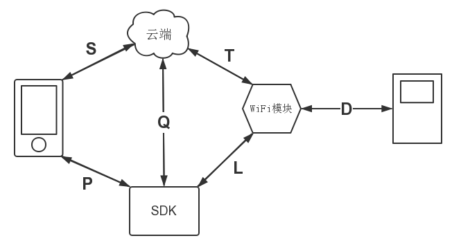

#P口协议 mobile with SDK

    make by wangyf@skyware.com.cn

changelog:

	2014-08-14 创建文档初稿 	by wangyf
	2014-08-22 修改设备参数表 	by wangyf
	2014-08-25 【重要】增加APP UI监控接口，APP进入和退出“设备监控界面”（可以显示设备状态的Activity）时，
				需要通知SDK，然后SDK以此作为TCP长短连接切换的依据	by wangyf
	2014-09-01 增加设计思路中小循环规划的“近场通信”与“设备联动”，补充“设计原则”，补充“SDK主要功能模块”
				“小循环当前问题”以及小循环的图例说明 	by wangyf

## 文档规约 ##

####名词&缩写解释

+ **L口协议**：SDK与WiFi模块协议
+ **P口协议**：SDK与手机端协议
+ **Q口协议**：SDK与服务器端协议

本文档用于说明P口协议，以及相关测试用例

##设计思路
###SDK设计原则
+ **解耦复用**：将APP与Server/Device间的通信细节屏蔽，将大小循环的路由选择屏蔽，让APP专注于功能和UI/UE设计，提高生产效率。通信逻辑与UI逻辑的分离使得双方的修改都不会影响到对方，只要保证接口的稳定。这样的设计提高了APP端程序的灵活性与可维护性。
+ **打包加密**：将SDK打成JAR/SO包提供给开发者，简洁可插拔且对通信细节起到保密作用
+ **平台化**：SDK是作为PAAS云平台的必备组件，是云生态的重要一环。良好设计和封装的SDK降低了合作开发者的技术门槛，控制开发成本，提高生产效率，合作共赢，繁荣云生态圈。开发者只需一键集成SDK，调用简单的接口，几行代码即可完成与设备和云端交互的复杂通信逻辑。

###SDK主要功能模块
+ **小循环**——全部协议实现，发现与维护设备、发送指令以及实时监控状态，屏蔽L口通信协议、MCU编码细节与设备厂家之间的差异
+ **大循环**——部分协议封装，配合小循环做路由选择
+ **配置设备连接WiFi**（EasyLink/ SmartLink）的封装，屏蔽WiFi模块厂商差异
+ **大数据采集与上报**——实时采集用户APP使用行为，设备控制行为信息，定期上报云平台供大数据分析

###SDK目标规划
+ **近期目标**：只负责发现维护设备、发送指令、状态改变上报这三大功能。发送指令和状态改变上报进行大小循环路由选择，优先选择小循环，大循环作为备选项，保证功能实现
+ **中长期目标**：根据不同开发者需求，完成三个版本的SDK
	+ 傻瓜版：对APP端完全屏蔽与Server和Device的通信细节,并提供一整套函数API接口，Device本地数据库也在SDK内维护
	+ 普通版：只对部分涉及大小循环路由的通信细节屏蔽，开放多种Device数据结构和指令列表供选择。
	+ 定制版：给APP开发人员最大权限，自定义Device和状态指令列表，定制部分通信协议细节。SDK仅负责消息透传

###小循环设计原则与目标
+ **快速高效**：收状态发指令更加快捷，提高用户体验
+ **降低云端负载**：如果手机检测到设备在内网，则发指令优先走小循环而不经过云端转发，降低云端负载
+ **迅速感知设备状态改变**：设备状态改变会通过小循环迅速到达APP端并显示在UI，尤其是设备异常与报警，会比大循环推送更加迅速感知到
+ **未来设想**：
	+ **本地模式**：完全不需要外网，完全局域网模式，小循环闭环实现
	+ **家庭中控**：家庭本地智能控制中心，无外网时替代云部分功能
	+ **设备联动**：未来的智能家居和物联网时代核心趋势是无人化自动化，这就需要设备之间能够相互沟通交流分享信息共同决策。这就需要彼此之间的协议统一与内网通讯。
	+ **近场通信**：未来app与可穿戴设备，或者可穿戴设备之间的通信必定是基于近场低功耗协议，如蓝牙或NFC等。也应作为小循环的范畴加以封装。

###小循环当前问题
+ **连接数限制**：由于小循环通信层采用TCP协议，较之UDP产生较大的内存与CPU开销，故资源极其有限的WiFi模块（可用内存几十K）无法承载更多连接。在汉枫的实现中，最多只能承受**5个TCP长连接**并发。也就意味着，除了与云平台的长连接，最多只能同时有4个APP终端与之通信。
+ **溢出机制不明**：如果WiFi模块达到连接数上限（汉枫实现即意味着超过4台连接），如何通知后面溢出的连接（即第5台请求连接）？目前利尔达并不清楚，需要汉枫的底层细节
+ **资源回收速度**：按照当前L口文档的说明，WiFi模块会主动剔除10s内无数据通信（未保持心跳）的连接，这相当于服务器端主动关闭，按照TCP协议规定，会等待2MSL时间才会释放相关Socket资源。2MSL的长短根据当前网络环境计算，短则数十秒，长则数分钟。这样有限的TCP连接资源不能快速回收利用，造成资源浪费，且影响APP端及时获取连接资源。
+ **连接意外断开检测**（已暂时解决）：如果用户意外离开Wifi局域网环境（这种情况生活中很常见，比如切换wifi，关闭wifi，离开wifi有效覆盖区），或者设备离开wifi环境（掉线，wifi信号弱等），对端如何检测到？解决方案：保持心跳与主动剔除
+ **超时重传不可控**：如果遇到由于内网网络环境差的情况（wifi信号弱、不稳定等）而产生丢包，TCP会在底层自动重传。问题在于TCP的拥塞控制机制会造成拥塞避免与指数退避，一开始的重传效率很低，如果连续丢包则重传间隔加倍增加，0.5s，1s，2s，4s...如此加倍。发生这种情况会严重影响小循环的设计原则——效率。如果采用TCP，一种折中的方案是在程序中设置超时时间来强制断开并返回。最好的方案是采用UDP自己控制重传逻辑。

###文档概要
+ P口协议对于APP来说采用“主动获取”和“异步上报”两种方式
+ **主动获取**：采用公开函数API的方式，APP开发者只需import API包并调用相关方法，SDK保证同步迅速回复结果
+ **异步上报**：采用Android的Broadcast方式，APP开发者自己注册Reciever来获取异步上报的消息
+ **接口数据格式**：所有的交互信息（传参和返回值）采用JSON格式，与S口相应协议保持一致，最大程度简化APP开发者集成
+ **跨平台**：目前仅支持Android端，未来会支持iOS系统

##如何集成SDK ##

###1. 导入Jar包并Import Java文件

###2. 配置AndroidManifest.xml
#####2.1 添加相应权限
    <uses-permission android:name="android.permission.ACCESS_COARSE_LOCATION" />
	<uses-permission android:name="android.permission.GET_TASKS" />
	<uses-permission android:name="android.permission.INTERNET" />
	<uses-permission android:name="android.permission.READ_PHONE_STATE" />
	<uses-permission android:name="android.permission.ACCESS_WIFI_STATE" />
	<uses-permission android:name="android.permission.ACCESS_NETWORK_STATE" />
	<uses-permission android:name="android.permission.RECEIVE_BOOT_COMPLETED" />
	<uses-permission android:name="android.permission.WRITE_EXTERNAL_STORAGE" />
	<uses-permission android:name="android.permission.VIBRATE" />
	<uses-permission android:name="android.permission.WAKE_LOCK" />
	<uses-permission android:name="android.permission.WRITE_SETTINGS" />
	<uses-permission android:name="android.permission.DISABLE_KEYGUARD" />
#####2.2 注册消息接收Reciever
客户端需实现自己的 MyPushMessageReceiver，接收 Push 服务的消息，并实现对消息的处理。以下是 AndroidManifest.xml 中的配置代码

	<!-- 用户自己定义接收器 -->
	<receiver 
		android:name="your.package.MyReceiver"
		android:enabled="true">
	    <intent-filter>
	        <!-- 接收异步上报消息 -->
	        <action android:name="com.skyware.skysdk.action.MESSAGE" />
	        <!-- 接收异步API return的执行结果消息 -->
	        <action android:name="com.skyware.skysdk.action.RESULT" />
	    </intent-filter>
	</receiver>

#####2.3 增加 service 配置

	<!-- 用于接收系统消息以保证 Service 正常运行 -->
	<receiver android:name="com.skyware.skysdk.receiver.SysReceiver"
	android:process=":skysdk_service_v1">
		<intent-filter>
			<action android:name="android.intent.action.BOOT_COMPLETED" />
			<action android:name="android.net.conn.CONNECTIVITY_CHANGE" />
		</intent-filter>
	</receiver>
	<!-- 接收客户端发送的各种请求-->
	<receiver android:name="com.skyware.skysdk.receiver.RegistrationReceiver"
	android:process=":skysdk_service_v1">
		<intent-filter>
			<action android:name="com.skyware.skysdk.action.METHOD " />
			<action android:name="com.skyware.skysdk.action.BIND_SYNC " />
		</intent-filter>
		<intent-filter>
			<action android:name="android.intent.action.PACKAGE_REMOVED"/>
			<data android:scheme="package" />
		</intent-filter>
	</receiver>

	<!-- SDK服务 -->
	<!-- 注意：在 4.0 (包含)之后的版本需加上如下所示的 intent-filter action -->
	<service android:name="com.skyware.skysdk.manager.SkySDKService"
	android:exported="true" android:process=":skysdk_service_v1">
		<intent-filter >
			<action android:name="com.skyware.skysdk.action.SDK_SERVICE"/>
		</intent-filter>
	</service>
	
	<!-- 百度云相关注册（略） -->

#####2.4 Reciever Demo
+ 设备上报消息通过 action=“com.skyware.skysdk.action.MESSAGE” 的 Intent 把数据发送给客户端 your.package.MyReceiver, 目前一共有四种设备变化的上报消息供处理
+ API调用回调通过 action = "com.skyware.skysdk.action.RESULT" Intent 返回给
your.package.MyReceiver, API的列表见后文

######
	package com.skyware.skysdk.demo;
	import android.content.BroadcastReceiver;
	import android.content.Context;
	import android.content.Intent;
	import android.os.Bundle;
	import android.util.Log;
	import com.skyware.skysdk.consts.SkySDKConst;

	public class DemoReceiver extends BroadcastReceiver
	{
		/** TAG to Log */
		public static final String TAG = DemoReceiver.class.getSimpleName();

		@Override
		public void onReceive(Context context, Intent intent) {

			Log.d(TAG, ">>> Receive intent: \r\n" + intent);
			String action = intent.getAction();

			// 设备上报消息  action == "com.skyware.skysdk.action.MESSAGE"
			if (action.equals(SkySDKConst.MESSAGE_ACTION)) {
				//消息类型
				int type = intent.getIntExtra(SkySDKConst.EXTRA_MSGTYPE);
				//消息内容
				String content = "";
				if (intent.getByteArrayExtra(SkySDKConst.EXTRA_CONTENT) != null) {
					content = new String(intent
						.getByteArrayExtra(SkySDKConst.EXTRA_CONTENT));
				}
				Log.d(TAG, "message received, msg type is: " + type + "content: " + content);

				// 根据消息类型进行处理
		        switch(type){
				case SkySDKConst.MSG_TYPE_DEVLIST_CHANGE:  //设备列表变化(设备个数变化)
					...
					break;
				case SkySDKConst.MSG_TYPE_DEVPARA_CHANGE:  //设备参数变化(一般状态+可控状态+传感状态)
					...
					break;
				case SkySDKConst.MSG_TYPE_DEVALARM:  //设备报警
					...
					break;
				default:
					...
					break;
				}
			}
		    // SDK API的异步返回结果 action == "com.skyware.skysdk.action.RESULT"
			else if (action.equals(SkySDKConst.RESULT_ACTION)) {
				//获取API方法名称,判断是哪个方法的返回结果
				String method = intent.getStringExtra(SkySDKConst.EXTRA_METHOD);
				//返回错误码，默认成功 ERROR_SUCCESS
				int errorCode = intent.getIntExtra(SkySDKConst.EXTRA_ERROR_CODE,
					SkySDKConst.ERROR_SUCCESS);
				if (errorCode != SkySDKConst.ERROR_SUCCESS) {
					// 错误信息
					String error = intent.getStringExtra(SkySDKConst.ERROR_CONTENT);
					Log.d(TAG, "command is: " + cmd + " result error: " + error);
				} 
		        else {
					Log.d(TAG, "command is: " + cmd + "result OK");
					String content = "";
					if (intent.getByteArrayExtra(SkySDKConst.EXTRA_CONTENT) != null) {
						//返回内容
						content = new String(intent
							.getByteArrayExtra(SkySDKConst.EXTRA_CONTENT));
					}
					
					//用户在此自定义处理消息,以下代码为 demo 界面展示用 
					Log.d(TAG, "onMessage: method : " + method);
					Log.d(TAG, "onMessage: result : " + errorCode);
					Log.d(TAG, "onMessage: content : " + content);
				}
				
			}
		}
	}
##API简介
###1.开放类###
本 SDK 中目前只有四个重要的开放类，分别为：SDK管理类 SkySDKManager、API类 APIManager、常量类 SkySDKConst。
<table style="font-size:14px">
	<tr><th>类</th>
		<th>描述</th>
		<th>包名</th></tr>
	<tr><td>SkySDKManager</td>
		<td>SDK的管理类，提供开启、停止、设置等静态方法</td>
		<td>com.skyware.skysdk.manager</td></tr>
	<tr><td>APISDKManager</td>
		<td>提供了所有业务功能类API的接口方法</td>
		<td>com.skyware.skysdk.manager</td></tr>
	<tr><td>SkySDKConst</td>
		<td>SDK所有对外的常量定义</td>
		<td>com.skyware.skysdk.consts</td></tr>
	<tr><td>SkySDKDevCmd</td>
		<td>控制设备的命令实体类</td>
		<td>com.skyware.skysdk.entity</td></tr>
</table>
###2.API分类####
本 SDK 目前支持以下接口：
<table style="font-size:14px">
	<tr><th>所属class</th>
		<th style="width:90px">分类</th>
		<th>功能</th>
		<th>API函数原型</th></tr>
	<tr><td>SkySDK Manager</td>
		<td>系统管理接口</td>
		<td>开启关闭服务，系统状态查询与设置，均为静态方法</td>
		<td>startWork、stopWork、resumeWork、isServiceEnabled、getVersion、setNoDisturbMode</td></tr>
	<tr><td  rowspan='5'>API Manager</td>
		<td>管理设备接口</td>
		<td>内网获取未绑定设备，查询设备网络状态</td>
		<td>getLocalUnbindDevices、getDevicesNetStat</td></tr>
	<tr><td>控制设备接口</td>
		<td>向发送设备指令</td>
		<td>operateDevice</td></tr>
	<tr><td>设备参数接口</td>
		<td>查询设备当前状态参数</td>
		<td>getDeviceParas、getDevicesParas</td></tr>
	<tr><td>异步上报接口</td>
		<td>主动订阅，异步上报设备列表、设备参数的变化以及设备报警捕捉</td>
		<td>(un)subscribeDevParaChange、(un)subscribeDevListChange、(un)subscribeDevAlarm</td></tr>
	<tr><td>监控UI接口</td>
		<td>当App进入/离开设备监控UI(Activity)时通知SDK</td>
		<td>notifyAccessDeviceMonitorUI、notifyLeaveDeviceMonitorUI</td></tr>
</table>

###3.异步上报接口####
+ 概述

	由于APP需要及时捕获设备的变化并及时在UI层进行变更来及时告知用户，所以我们为开发者提供及时获取设备状态变化的接口，封装了底层的监听。
	
	目前的异步接口分为两类，一类是异步函数返回，即调用API的返回值是异步方式返回。另一类是类似订阅机制，用户想要监听哪些值，通过订阅API告知SDK，一旦SDK检测到相应值变化，立即异步上报用户。这两类都是通过BroadCast机制发送异步消息，用户通过注册自己的Reciever来监听。具体方法见2.4的Demo

	下面我们介绍一下第二类异步接口，即订阅设备属性状态变化的机制。而第一类会在后面相应的API中说明。

+ 订阅/取消订阅的函数原型

		//订阅设备参数变化
		void subscribeDevParaChange(int devParaCode)
		void unsubscribeDevParaChange(int devParaCode)

		//订阅设备列表变化
		void subscribeDevListChange(int devListCode)
		void unsubscribeDevListChange(int devListCode)

		//订阅设备列表报警
		void subscribeDevAlarm(int devAlarmCode)
		void unsubscribeDevAlarm(int devAlarmtCode)

+ 参数值
	
	+ `devParaCode`：设备参数位码
	
		采用按位与的方式，将所有想要监听（或者取消监听）的设备参数用位与符号 `|` 连接起来。

		比如要监听设备的管理状态（Manage）和可控状态（Control），这样调用：

			api.subscribeDevParaChange(SkySDKConst.DEVPARA_MANAGE_ALL
								|SkySDKConst.DEVPARA_CONTROL_ALL)

		如果要监听设备的管理状态（Manage）的在线状态（Online）和可控状态（Control）中的开关（Power），以及传感器状态（Sensor）的温度（Tem），我们需要这样调用：

			api.subscribeDevParaChange(SkySDKConst.DEVPARA_MANAGE_NET_ONLINE
								|SkySDKConst.DEVPARA_CONTROL_POWER
								|SkySDKConst.DEVPARA_SENSOR_TEM)

		如果要监听设备的所有参数呢？聪明的读者或许已经猜到了，我们只需这样调用：

			api.subscribeDevParaChange(SkySDKConst.DEVPARA_ALL)

		所有设备参数常量的分类和名称如下表所示（都包含在SkySDKConst常量类中）：
		<table style="font-size:13px">
			<tr><th width="80px" style="word-break:break-all;">分类</th>
				<th>常量名</th><th>文字描述</th>
				<th>json key</th><th>取值范围</th></tr>
			<tr><td rowspan='12'>管理状态 Manage</td>
			<tr><td>DEVPARA_MANAGE_NET_ONLINE</td><td>是否在线</td>
				<td>online</td><td>0-不在线 1-在线</td>
			<tr><td>DEVPARA_MANAGE_NET_LOCAL</td><td>是否在局域网</td>
				<td>local</td><td>0-不在内网 1-在内网</td>
			<tr><td>DEVPARA_MANAGE_LOCATION_P</td><td>地理位置--省</td>
				<td>province</td><td>String</td>
			<tr><td>DEVPARA_MANAGE_LOCATION_C</td><td>地理位置--市</td>
				<td>city</td><td>String</td>
			<tr><td>DEVPARA_MANAGE_LOCATION_D</td><td>地理位置--地区</td>
				<td>district</td><td>String</td>
			<tr><td>DEVPARA_MANAGE_NAME</td><td>设备名称</td>
				<td>device_name</td><td>String</td>
			<tr><td>DEVPARA_MANAGE_LOCK</td><td>锁定状态</td>
				<td>locked</td><td>0-未锁定，1-已锁定</td>
			<tr><td>DEVPARA_MANAGE_BIND</td><td>绑定状态</td>
				<td>bind</td><td>0-未绑定，1-已绑定</td>
			<tr><td>DEVPARA_MANAGE_TIME_ADD</td><td>设备添加时间</td>
				<td>addtime</td><td>UNIX时间戳</td>
			<tr><td>DEVPARA_MANAGE_TIME_UPDATE</td><td>最后更新时间</td>
				<td>updatetime</td><td>UNIX时间戳</td>
			<tr><td>DEVPARA_MANAGE_EXCEPTION</td><td>异常状态</td>
				<td>exception</td><td>String</td>
			<tr><td rowspan='7'>可控状态 Control</td>
				<td>DEVPARA_CONTROL_POWER</td><td>电源</td>
				<td>power</td><td>0-关，1-开</td>
			<tr><td>DEVPARA_CONTROL_KLOCK</td><td>童锁</td>
				<td>klock</td><td>0-关，1-开</td>
			<tr><td>DEVPARA_CONTROL_WIND</td><td>风速</td>
				<td>wind</td><td>0-关，1~5-五个档</td>
			<tr><td>DEVPARA_CONTROL_UV</td><td>UV杀菌</td>
				<td>uv</td><td>0-关，1-开</td>
			<tr><td>DEVPARA_CONTROL_ANION</td><td>负离子</td>
				<td>anion</td><td>0-关，1-开</td>
			<tr><td>DEVPARA_CONTROL_MODE</td><td>模式</td>
				<td>mode</td><td>0-关，1-auto，2-sleep</td>
			<tr><td>DEVPARA_CONTROL_TIMER</td><td>定时器</td>
				<td>timer</td><td>0~12 - 0到12小时</td>
			<tr><td rowspan='7'>传感器状态 Sensor</td>
				<td>DEVPARA_SENSOR_TEMP</td><td>温度</td>
				<td>tem</td><td>0-60</td>
			<tr><td>DEVPARA_SENSOR_HUM</td><td>湿度</td>
				<td>hum</td><td>10%-95%</td>
			<tr><td>DEVPARA_SENSOR_PM</td><td>PM值</td>
				<td>pm</td><td>0-999</td>
			<tr><td>DEVPARA_SENSOR_FILTER</td><td>滤网剩余时间</td>
				<td>net_time</td><td>0-4320</td>
		</table>
		注：以上设备参数仅包含会改变的值，如设备ID、MAC、SN这三个字段作为设备唯一标识一般则不会改变。故也不需要监听其变化

	+ `devListCode`：设备列表位码

		同样采用按位与的方式，将所有想要监听（或者取消监听）的设备列表变化类型用位与符号 `|` 连接起来。
		
		<table style="font-size:13px">
			<tr><th style="width:110px">分类</th>
				<th>常量名</th><th>文字描述</th><th>json value</th></tr>
			<tr><td rowspan='3'>发现设备 Discover</td>
				<td>DEVLIST_DISCOVER_NEW</td><td>发现新设备</td>
				<td>new</td>
			<tr><td>DEVLIST_DISCOCER_MISS</td><td>新设备消失</td>
				<td>miss</td>
			<tr><td>DEVLIST_DISCOVER_ALL</td><td>所有关于发现设备的变化</td>
				<td></td>
			<tr><td rowspan='4'>绑定设备的数量变化 Bind</td>
				<td>DEVLIST_BIND_ADD</td><td>新绑定设备</td>
				<td>add</td>
			<tr><td>DEVLIST_BIND_DEL</td><td>解绑(删除)设备</td>
				<td>del</td>
			<tr><td>DEVLIST_BIND_ERROR</td><td>设备异常消失</td>
				<td>error</td>
			<tr><td>DEVLIST_BIND_ALL</td><td>所有关于设备列表的变化</td>
				<td></td>
			<tr><td></td><td>DEVLIST_ALL</td><td>设备列表的所有变化类型</td>
				<td></td>
		</table>

		注：发现新设备同属DEVLIST_NEW

		比如要监听设备发现以及设备列表的增加，这样调用：

			api.subscribeDevListChange(SkySDKConst.DEVLIST_DISCOVER_ALL
									|SkySDKConst.DEVLIST_BIND_MORE)

		不过，如果你没有特殊的需求，只需要监听所有变化即可：

			api.subscribeDevListChange(SkySDKConst.DEVLIST_ALL)

	+ `devAlarmCode`：设备报警位码

		PS: 这部分暂未考虑，会在下个版本加入

+ 返回值

	异步返回json格式。通过action = com.skyware.skysdk.action.MESSAGE 的广播Intent 发送给客户端 receiver，Intent extra SkySDKConst.EXTRA_CONTENT 中包含该消息内容，SkySDKConst.EXTRA\_MSGTYPE 中包含该消息类型

	+ 设备参数变化 EXTRA\_MSGTYPE == SkySDKConst.MSG\_TYPE\_DEVPARA\_CHANGE

			管理状态---设备不在线推送提醒
			{
				"deviceId":"1313131"
			    "deviceOnline":"0",
			}
			0:不在线；1：为在线

			可控状态
			{
				"deviceId":"1313131",
				"data":{
				    "switch":"on",
				    "winds ":"1",
				    "lock":"1"
				}
			}
			
			传感器状态
			{
				"deviceId":"1313131",
				"data":{
				    "tem":"30",
				    "hum ":"10",
				    "pm":"15",
				    "net_time":"15",
				}
			}
			
			滤网过期提醒
			{
				"deviceId":"1313131"
				"net_time":"15",
				"isOverdue":"0",
			}			
			如果值为1：过期，0：不过期

		

	+ 设备列表变化 EXTRA\_MSGTYPE == SkySDKConst.MSG\_TYPE\_DEVLIST\_CHANGE

			发现新设备
			{
				"change_type":"new",
				"total":"2",
				"result":[
					{
						"deviceid":"984433027",
						"deviceMac":"DD4F225566CC",
					}，
					{
						"deviceid":"554433553",
						"deviceMac":"ACCF23216434",
					}
				]
			}

			新设备消失
			{
				"change_type":"miss",
				"total":"2",
				"result":[
					{
						"deviceid":"984433027",
						"deviceMac":"DD4F225566CC",
					}，
					{
						"deviceid":"554433553",
						"deviceMac":"ACCF23216434",
					}
				]
			}
			
			新添加/绑定设备
			{
				"change_type":"add",
				"total":"1",
				"result":[
					{
						"deviceid":"554433553",
						"deviceMac":"ACCF23216434",
					}
				]
			}
			
			删除/解绑设备
			{
				"change_type":"del",
				"total":"1",
				"result":[
					{
						"deviceid":"554433553",
						"deviceMac":"ACCF23216434",
					}
				]
			}			
			
			设备异常消失
			{
				"change_type":"error",
				"total":"1",
				"result":[
					{
						"deviceid":"554433553",
						"deviceMac":"ACCF23216434",
					}
				]
			}	

	+ 设备报警 EXTRA\_MSGTYPE == SkySDKConst.MSG\_TYPE\_DEVALARM

		PS: 这部分暂未考虑，会在下个版本加入

+ 何时调用

	理论上说只要在需要获取变化的代码之前（时序）任何地方申请订阅或者取消订阅就可以。一旦你订阅了某些设备参数，设备一有变化我们就会及时的上报。取消订阅也一样，一旦你取消某些设备参数，这些参数变化后SDK就不再BroadCast。

	不过我们建议在初始化SDK后（StartWork）就进行订阅，最好都放在MainActivity的OnCreate方法中。

	
##API详细
### 1.系统管理接口 ###
####1.1 开启与初始化服务--startWork####
+ 函数原型

	    public static void startWork(Context context, String usrInfo)

+ 功能

    `SkySDKManager类` 定义的静态方法，完成Service的初始化

+ 参数

	`context`：当前执行 Context
	
    `usrInfo`：用户一些基本信息，用来完成。Json格式

+ 返回
	
	无
	

####1.2 停止服务--stopWork####
+ 函数原型

		public static void stopWork(Context context)

+ 功能

    `SkySDKManager类` 定义的静态方法，停止本应用服务进程。 startWork和 resumeWork 都会重新开启本应用服务。

+ 参数

	`context`：当前执行 Context

+ 返回

	无

####1.3 恢复服务--resumeWork####
+ 函数原型

		public static void resumeWork(Context context)

+ 功能

    `SkySDKManager类` 定义的静态方法，恢复本应用服务。

+ 参数

	`context`：当前执行 Context

+ 返回

	无

####1.4 查询后台监听Service是否被停止的接口-- isServiceEnabled####
+ 函数原型

		public static boolean isServiceEnabled(Context context)

+ 功能

    `SkySDKManager类` 定义的静态方法，查询后台service是否已经被停止。

+ 参数

	`context`：当前执行 Context

+ 返回

	boolean值，true--service正常，false--被停止

####1.5 查看当前SDK版本号-- getVersion####
+ 函数原型

		public static String getVersion(Context context)

+ 功能

    `SkySDKManager类` 定义的静态方法，获取当前SDK的版本号。

+ 参数

	`context`：当前执行 Context

+ 返回

	String值，当前SDK版本号

####1.6 设置免打扰时段-- setNoDisturbMode####
+ 函数原型

		public static void setNoDisturbMode(Context context, int startHour, int startMinute, int endHour, int endMinute)

+ 功能

    `SkySDKManager类` 定义的静态方法，设置免打扰模式的具体时段，该时间内处于免打扰模式，通知到达时去除通知的提示音、振动以及提示灯闪烁。

+ 参数

	`context`：当前执行 Context

	`startHour，startMinute`：起始时间，24 小时制，取值范围 0~23，0~59
	
	`endHour，endMinute`：结束时间，24 小时制，取值范围 0~23，0~59

+ 返回

	无

####1.7 获取APIManager单例-- getAPIManager()####
+ 函数原型

		public static void APIManager getAPIManager(Context context)

+ 功能

    `SkySDKManager类` 定义的静态方法，获取APIManager的单例，用来调用API。

+ 参数

	`context`：当前执行 Context

+ 返回

	APIManager单例

### 2.管理设备接口 ###

####2.1 获取内网所有未绑定的设备####

+ 函数原型

		String getLocalUnbindDevices()

+ 功能

    `APIManager类` 定义的方法，用户选择快速绑定时，获取所有内网与本userId未绑定且未锁定的设备供用户选择。

+ 参数

	无

+ 返回

		设备列表 JSON
		{	
			"total":"2",
			"result":[
				{
					"deviceid":"984433027",
					"deviceSn":"6922374562004",
					"deviceLocation":"重庆",
					"deviceLock":"0",
					"deviceMac":"DD4F225566CC",
					"deviceName":"空调1",
				}，
				{
					"deviceid":"554433553",
					"deviceSn":"3322114562443",
					"deviceLocation":"北京",
					"deviceLock":"0",
					"deviceMac":"ACCF23216434",
					"deviceName":"",
				}
			]
		}

####2.2 查询设备的网络状态####

+ 函数原型

		String getDevicesNetStat(String[] deviceId)

+ 功能

    `APIManager类` 定义的方法，获取某台（某几台）设备的网络状态（是否在内网，是否在线）

+ 参数

	`deviceId`：设备ID数组

+ 返回

		设备网络状态 JSON
		{	
			"total":"2",
			"result":[
				{
					"deviceid":"984433027",
					"deviceMac":"DD4F225566CC",
					"online":"0" //0--offline	1--online
					"local":"1"	 //0--remote	1--local
				}，
				{
					"deviceid":"554433553",
					"deviceMac":"ACCF23216434",
					"online":"1" 
					"local":"0"	 
				}
			]
		}
+ 补充

	关于网络状态，目前分为两个维度，在不在内网（LOCAL/REMOTE），连没连上云平台（ONLINE/OFFLINE），彼此不互斥，可两两组合，一共四种组合。下面是4种组合的意义：
	<table style="font-size:14px">
		<tr><td></td><th>LOCAL</th><th>REMOTE</th></tr>
		<tr><th>ONLINE</th><td>在内网且连接云平台（优先小循环）</td><td>不在内网但连接云平台（在其他wifi环境下，可远程控制）</td></tr>
		<tr><th>OFFLINE</th><td>在内网但未连接云平台（只能走小循环）</td><td>不在内网且未连接云平台（彻底无法连接的状态，无法远程控制）</td></tr>
	</table>

###3、控制设备接口###

####3.1 控制设备####

+ 函数原型

		//采用Json格式封装指令
		void operateDevice(String jsonCmd)

		//采用命令实体类DevCmdInfo封装命令
		void operateDevice(SkySDKDevCmd cmdInfo)

+ 功能

    `APIManager类` 定义的方法，用来向设备发送操作指令

+ 参数

	+ `jsonCmd`：命令的Json格式

			{
				"loginid":"131311233",
				"devicid":"995753324",
				"commondv":{
						"sn":"1023",
						"cmd":"download",
						"data":[
							"power::1",
        					"wind::2"
						]
					}
			}

	+ `cmdInfo`：命令实体类

		`SkySDKDevCmd` 类是公共类，开发者只需import进来后进行如下操作即可：

			//创建DevCmdInfo类对象
			SkySDKDevCmd cmdInfo = new SkySDKDevCmd();

			//设置用户userId
			cmdInfo.setUserId("131311233");

			//设置想要控制设备的设备ID
			cmdInfo.setDeviceId("995753324");

			//设置指令的类型，如果不设置则为默认值SINGLE(单台单指令)
			cmdInfo.setCmdType(SkySDKConst.COMMAND_TYPE_GROUP);

			//（单指令，cmdType == COMMAND_TYPE_SINGLE ）
			// 设置指令的参数，第一个参数仅限于设备参数中的可控参数，第二个参数为具体值（String类型,参见上文对照表）
			cmdInfo.setCmdPara(SkySDKConst.DEVPARA_CONTROL_POWER, "1");
			
			//（多指令，cmdType == COMMAND_TYPE_GROUP ）
			// 设置指令的参数，需要建一个Map对象作为参数传入，将命令KV对放入map
			Map<Integer,String> map = new HashMap<Integer,String>();
			map.put(SkySDKConst.DEVPARA_CONTROL_POWER,"1");
			map.put(SkySDKConst.DEVPARA_CONTROL_WIND,"2");
			cmdInfo.setCmdParas(map);

			//发送指令
			api.operateDevice(cmdInfo);

		下面介绍一下在 `SkySDKConst` 中定义的三种指令类型：
		<table style="font-size:13px">
			<tr><th>指令类型常量名</th><th>说明</th></tr>
			<tr><td>COMMAND_TYPE_SINGLE</td><td>单台设备单个指令</td></tr>
			<tr><td>COMMAND_TYPE_GROUP</td><td>单台设备一组指令</td></tr>
			<tr><td>COMMAND_TYPE_LINKAGE</td><td>多台设备联动指令（暂未实现）</td></tr>
		</table>

+ 返回

	<b style="color:red">异步返回</b>。通过action = com.skyware.skysdk.action.RESULT 的广播Intent 发送给客户端 receiver，Intent extra SkyDKConst.EXTRA_CONTENT 中包含返回字符串，json 格式：
	
		{"ret":"200"}

	如果成功返回200，代表指令设备成功收到。如果错误返回对应错误码，见下表：
	<table style="font-size:13px">
		<tr><th>ret值</th><th>解释 </th></tr>
		<tr><td>200</td><td>设备成功收到指令包 </td></tr>
		<tr><td>403</td><td>设备未授权</td></tr>
		<tr><td>404</td><td>未接收到主控的串口数据</td></tr>
		<tr><td>500</td><td>服务器与WiFi模块间的连接断开，无法完成客户请求</td></tr>
		<tr><td>501</td><td>不支持此协议</td></tr>
		<tr><td>503</td><td>WiFi模块负载重，请设备稍后再发</td></tr>
	</table>

	<b style="color:red">注意</b>：这里的返回值仅代表该指令成功发送，并不能代表该指令是否成功执行以及执行结果是什么。
	
	现在的问题是：我们怎么知道这个操作到底成功还是没成功呢？
	
	我们目前采用**“指令与状态反馈分离”**的方式，用户发送一个指令，API只负责转发设备的ret值，表示设备已经收到（或这没收到）此指令。至于指令执行的结果，设备若执行成功会触发状态改变的事件，SDK会及时上报设备的状态参数改变，Receiver收到后及时反馈在UI层，用户就知道是否执行成功了。

###4、设备参数接口###

####4.1 获取多台设备当前所有状态参数####

+ 函数原型

		String getDevicesParas(String[] deviceId)

+ 功能

    `APIManager类` 定义的方法，返回多台设备（可以只有一台）的当前所有设备状态参数，包括一般状态、可控状态和传感器状态

+ 参数

	无

+ 返回

		{	
		    "total":"2",
		    "result":[
			    {
				    "deviceid":"984433027"，
					"deviceMac":"ACCF23216434",
					"deviceSn":"6922374562004",
					"deviceLocation":"重庆",
				    "deviceLock":"1",
				    "deviceName":"空调--卧室",
					"deviceData":
				    {
				        "tem":"4",
				        "pw":"7",
				        "hum":"22"
				     },
			        "deviceDesc1":"1407722795798",
			        "deviceDesc2":"
			        {   
				        "power":"0",
				        "wind":"2",
				        "time":"3",
				        "anion":"0",
				        "mode"："2"
			        },
				},
				{
				    "deviceid":"445533003"，
					"deviceMac":"CCABBFF16431",
					"deviceSn":"2223377552201",
					"deviceLocation":"北京",
				    "deviceLock":"1",
				    "deviceName":"净化器",
					"deviceData":
				    {
				        "tem":"20",
				        "pw":"70",
				        "hum":"25"
				     },
			        "deviceDesc1":"1407722795798",
			        "deviceDesc2":"
			        {   
				        "power":"1",
				        "wind":"3",
				        "time":"4",
				        "anion":"5",
				        "mode"："2"
			        },
				}
			]

		}

####4.2 获取某台设备当前的特定设备参数####

+ 函数原型

		String getDeviceParas(String deviceId，int devParaCode)

+ 功能

    `APIManager类` 定义的方法，获取单台设备的某些特定设备参数。通过`devParaCode` 采用按位与的方式指定

+ 参数

	`deviceId`：设备ID

	`devParaCode`：设备参数位码，使用方式参见 `API简介` 中的第三节

+ 返回

		{	
			"total":"1",
			"result":{
			    "id":"984433027"，
				"deviceMac":"ACCF23216434",
				"deviceSn":"6922374562004",
				"deviceLocation":"重庆",
			    "deviceLock":"1",
			    "deviceName":"空调--卧室",
				"deviceData":
			    {
			        "tem":"4",
			        "pw":"7",
			        "hum":"22"
			     },
		        "deviceDesc1":"1407722795798",
		        "deviceDesc2":"
		        {   
			        "power":"0",
			        "wind":"2",
			        "time":"3",
			        "anion":"0",
			        "mode"："2"
		        },
			}
		}

###5、监听UI接口###

####5.1 进入/离开监控设备UI界面(Activity)通知####

+ 函数原型
		
		//通知SDK App进入监控设备的UI
		void notifyAccessDeviceMonitorUI();
		
		//通知SDK App离开监控设备的UI
		void notifyLeaveDeviceMonitorUI();
+ 功能

    `APIManager类` 定义的方法，通知SDK APP何时进入和离开设备监控UI，用来切换TCP的长短连接。

+ 参数

	无

+ 返回
	
	void